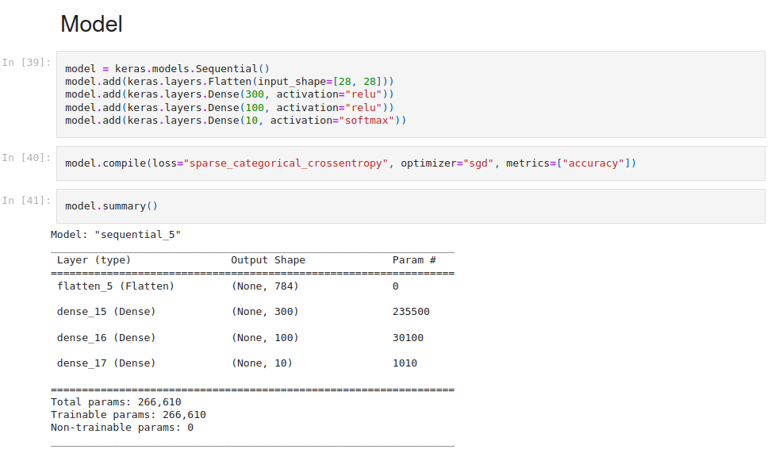

# Project Report on Creating a Neural Network on The Fashion MNIST Dataset

For this project, an extensive and comprehensive understanding of how the parameters and the architecture of the neural networks affect and impact each other was required in order to appreciate and comprehend the application of neural networks. Using the Fashion MNIST dataset, I was able to develop a neural network model as well as interact with various hyperparameters and the architecture involved.

## Analysis

The following are the main hyperparameters and architecture utilized in the model:
a. Optimizer
b. The number of neurons in the neural network layers
c. Learning rate 1. Optimizer.
To understand how the optimizer affects the model, three different types of optimizers were used. The SGD, RMSprop, and Adam Optimizers. The optimizers were subject to similar features of the model. For instance, 3 layers were used with 300, 100, and 10 neurons respectively, 20 epochs, and a default learning rate of 0.01 was used.

▪ The SGD optimizer- helped the model acquire 82.31% accuracy.
▪ The RMSprop optimizer- helped the model achieve 86.46%.
▪ The Adam optimizer- helped the model achieve 87.14%.

Observation: Thus, the ‘Adam’ optimizer seemed to be the best choice for developing the model at a lower loss. 2. Number Of Neurons in Neural Network Layers
Importantly, it is very useful to understand how the number of layers affects the model. Thus, I decreased and increased the number of layers to understand their impact on the model, precisely model accuracy. All the layers were subject to the same optimizer, that is Adam and 20 epochs.

▪ The first instance I used 100 neurons in layer 1, 50 neurons in layer 2, and 10 neurons in layer 3. Results: accuracy achieved 84.26%.
▪ The second instance, layer 1-200, layer 2-100, layer 3-10. Results: 86.40% accuracy.
▪ The third instance, layer 1-450, layer 2-200, layer 3-10. Results: 87.87% accuracy.
Observation: Increase in the number of neurons resulted in an increase in the accuracy score of the model. 3. Learning Rate.

Lastly, I interacted with the learning rate of the model to comprehend its impact on the results. All the learning rates were subject to similar features including 450 neurons in layer 1, 200 neurons in layer 2, and 10 in layer 3. Typically, the default learning rate is 0.01.

▪ The first instance, the learning rate=0.01(default). Results: Accuracy 85.26%
▪ The first instance, the learning rate=0.06. Results: Accuracy 86.23%
▪ The second instance, the learning rate=0.10. Results: Accuracy 86.13%

## Observation

Increase in the learning rate results in an improvement in accuracy. However, there is an optimal level in which no more accuracy is achieved with an increase in the learning rate.
Final Average Accuracy, includes the average of all the model accuracies.  
Final Average Accuracy = 82.31+86.46+87.14+84.26+86.40+87.87+85.26+86.23+86.13
= 772.06 / 9
= 85.78%
Final Average Accuracy = 85.78%
